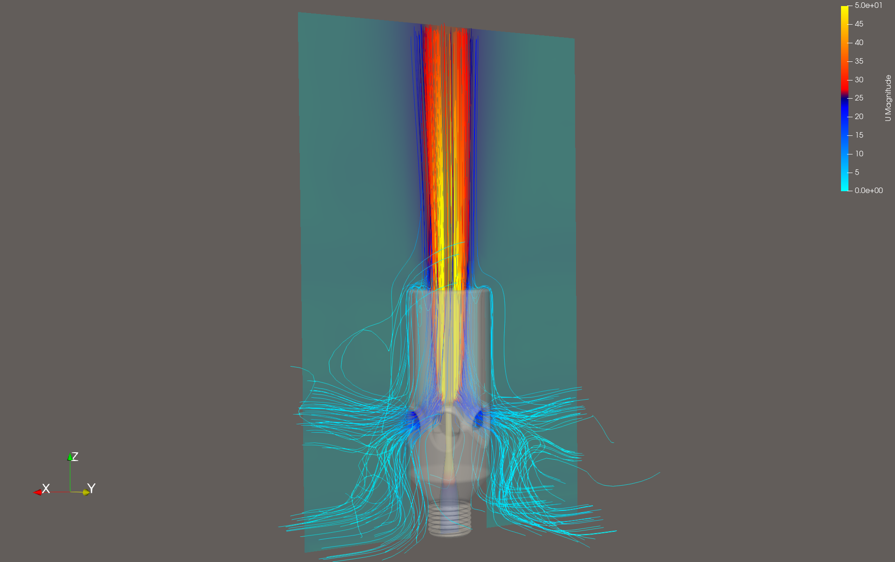

# VenturiPost & OpenFOAM CFD Environment Setup

[](LICENSE)
[](https://apple.com)

**VenturiPost** is an automated post-processing GUI application and setup guide for compressible Venturi nozzle and ejector CFD simulations, coupling FreeCAD CfdOF and high-speed OpenFOAM/HiSA workflows in Docker on macOS Apple Silicon.

---

## Table of Contents

1. [Overview](#overview)
2. [VenturiPost GUI Application](#venturipost-gui-application)
   - [Features](#features)
   - [Calculations & Key Metrics](#calculations--key-metrics)
   - [CSV Export & Excel Compatibility](#csv-export--excel-compatibility)
   - [Running VenturiPost](#running-venturipost)
   - [Building Standalone App (`.app`)](#building-standalone-app-app)
3. [Example Case: 2mm Venturi Ejector Nozzle](#example-case-2mm-venturi-ejector-nozzle)
   - [Simulation Setup & Boundary Conditions](#simulation-setup--boundary-conditions)
   - [Post-Processing Results (VenturiPost)](#post-processing-results-venturipost)
4. [macOS Apple Silicon CFD Environment Setup](#macos-apple-silicon-cfd-environment-setup)
   - [Architecture & Overview](#architecture--overview)
   - [Phase 1: Prerequisites & Application Installation](#phase-1-prerequisites--application-installation)
   - [Phase 2: Platform Isolation (Host vs FreeCAD)](#phase-2-platform-isolation-host-vs-freecad)
   - [Phase 3: Custom Docker Image Build (`opencfd-mac`)](#phase-3-custom-docker-image-build-opencfd-mac)
   - [Phase 4: Patching CfdOF Source (`CfdTools.py`)](#phase-4-patching-cfdof-source-cfdtoolspy)
   - [Phase 5: FreeCAD Parameter Registration](#phase-5-freecad-parameter-registration)
   - [Phase 6: Verification](#phase-6-verification)
5. [Typical Simulation & Analysis Workflow](#typical-simulation--analysis-workflow)
6. [Acknowledgements & Funding](#acknowledgements--funding)
7. [License](#license)

---

## Overview

Simulating supersonic and compressible ejector/venturi nozzle aerodynamics requires:

- **CAD & Setup**: FreeCAD with the CfdOF Workbench.
- **Solvers & Meshing**: OpenFOAM (v2512) and the coupled high-speed solver **HiSA** (High-Speed Aerodynamic Solver) along with **cfMesh** and **Gmsh** running in an optimized Linux Docker container accelerated by Apple Silicon's Rosetta 2 virtualization.
- **Post-Processing**: **VenturiPost**, a native Python/Tkinter GUI tailored specifically for extracting mass flow rates, standard volume flow rates (Nl/min), flow amplification factors, and center probe velocities/pressures directly from the case directories.

---

## VenturiPost GUI Application

**VenturiPost** (`cfd_flow_gui.py`) simplifies and automates the evaluation of OpenFOAM case outputs.

### Features

- **Automatic Parameter Detection (`🔄 Reload from Case`)**:
  - Scans `0/p` and `0/T` for boundary conditions and internal fields.
  - Automatically parses inlet gauge pressure, ambient pressure, temperature, and patch names.
- **Docker-Coupled Post-Processing (`⚡ Start Analysis`)**:
  - Executes containerized OpenFOAM utility routines (`reconstructPar`, `surfaceFieldValue`, `probes`) without manual CLI scripting.
- **Standardized Norm Volume Flow Rates**:
  - Automatically computes mass flows and standard volume flow rates according to both ISO (20°C, 1.01325 bar, ρ = 1.2041 kg/m³) and DIN (0°C, 1.01325 bar, ρ = 1.2930 kg/m³).
- **Flow Amplification Factor**:
  - Computes the ejector entrainment efficiency (ratio of entrained plane mass flow to driving inlet nozzle mass flow).
- **Centerline Probe Evaluation**:
  - Extracts local velocity magnitude |U| (in m/s and km/h), directional vector components (Ux, Uy, Uz), and static pressure (Pa and bar abs) at the target plane distance.
- **Integrated Logging & Console Clear (`🗑️ Clear Console`)**:
  - Real-time protocol window displaying all intermediate calculations, densities, and extracted values.

### Calculations & Key Metrics

#### 1. Gas Densities

Ideal gas law based on specific gas constant R = 287.058 J/(kg·K):

```math
\rho = \frac{p_{\text{abs}}}{R \cdot T_{\text{Kelvin}}}
```

#### 2. Standard Volume Flow (ISO & DIN)

Volumetric norm flow in Nl/min:

```math
\dot{V}_{\text{norm}} = \frac{\dot{m} \cdot 60}{\rho_{\text{norm}}} \times 1000 \quad [\text{Nl/min}]
```

#### 3. Flow Amplification Factor

Ratio of entrained plane mass flow to inlet nozzle mass flow:

```math
\text{Flow Amplification Factor} = \frac{{\dot{m}}_{\text{plane}}}{{\dot{m}}_{\text{inlet}}}
```

### CSV Export & Excel Compatibility

- **`📊 Export to CSV...`**: Appends each evaluated run as a new row in a cumulative CSV file.
- **Locale-Aware Formatting**:
  - Dynamically detects the system locale decimal delimiter (`.` or `,`).
  - Automatically chooses `;` as separator if `,` is used as decimal separator, preventing German/European Excel from misinterpreting numbers as dates or corrupting columns.
  - Safely handles open-file locks with user-friendly retry warnings if the file is currently locked in Excel.

### Running VenturiPost

Launch using Python (Tkinter required):

```bash
python cfd_flow_gui.py
```

### Building Standalone App (`.app`)

To build the macOS application bundle [`dist/VenturiPost.app`](dist/VenturiPost.app):

```bash
pyinstaller --noconsole --windowed --name "VenturiPost" --icon "VenturiPost.icns" --noconfirm cfd_flow_gui.py
```

---

## Example Case: 2mm Venturi Ejector Nozzle

The [`Example/`](Example/) directory contains a complete reference simulation case of an ejector nozzle:

- **FreeCAD Simulation Setup**: [`Example/CFD Venturi 2mm.FCStd`](Example/CFD%20Venturi%202mm.FCStd) — 3D CAD model and CfdOF boundary/case setup.
- **Nozzle Geometry (STL)**: [`Example/CFD Venturi 2mm-Venturi Nozzle.stl`](Example/CFD%20Venturi%202mm-Venturi%20Nozzle.stl) — Exported 3D nozzle surface for 3D printing. Connects to compressor with 1/4 BSP fitting.
    > ⚠️ **CAUTION:** Use at your own risk!
- **ParaView Streamline Visualization**:

<p align="center">
  
</p>

*Figure: 3D streamline visualization in ParaView displaying secondary ambient air suction into the side entrainment ports and supersonic jet mixing along the center z-axis.*

### Simulation Setup & Boundary Conditions

The simulation case in FreeCAD CfdOF is configured with the following settings:

1. **Physics Model (`PhysicsModel`)**:
   - Time: Steady state
   - Flow: Compressible
   - High Mach Number: Enabled
   - Isothermal: Disabled
   - Turbulence Model: RANS (k-ω SST)

2. **Fluid Properties (`FluidProperties`)**:
   - Material: `AirCompressible` (standard definition)

3. **Boundary Conditions**:
   - **`inlet`** (*Pressure / Inlet*):
     - Total/Static Pressure: 300 kPa (3.0 bar abs)
     - Temperature: 293.15 K (20°C)
   - **`open`** (*Open / Environment*):
     - Static Pressure: 100 kPa (1.0 bar abs)
     - Temperature: 293.15 K (20°C)
   - **`wall`** (*No-slip Wall*):
     - Subtype: Rough
     - Roughness height (Ks): 0.1 mm (estimated equivalent sand-grain roughness for FDM 3D printing at 0.2 mm layer height)
     - Roughness constant (Cs): 0.5

4. **Initial Conditions (`InitialiseFields`)**:
   - Pressure: Set from `inlet` (300 kPa)
   - Temperature: 290.15 K
   - Velocity: Uz = 5.0 m/s

5. **Mesh Generation (`Solid_Mesh`)**:
   - Mesher: `snappyHexMesh`
   - Base Element Size: 3.93 mm (calculated automatically)
   - **Refinement 1 (`MeshRefinement` - Nozzle Throat & Inner Walls)**:
     - Relative length: 0.2 (resulting cell size ≈ 0.8 mm)
     - Boundary layer: 2 layers (expansion ratio 1.2)
   - **Refinement 2 (`MeshRefinement001` - Ejector Mixing Tube & Suction Ports)**:
     - Relative length: 0.5 (resulting cell size ≈ 2.0 mm)
     - Boundary layer: 2 layers (expansion ratio 1.2)

6. **Solver Settings (`CfdSolver`)**:
   - Solver: `HiSA` (automatically selected by CfdOF)
   - Settings: Default CfdOF solver parameters

### Post-Processing Results (VenturiPost)

Below is the console output generated by VenturiPost for this ejector case evaluated at downstream distance z = 100 mm:

```text
FLOW ANALYSIS RESULTS:
----------------------------------------------------------------
Position         | Mass [kg/s]   | ISO [Nl/min] | DIN [Nl/min]
----------------------------------------------------------------
Inlet            | 0.001600      | 79.7         | 74.3
Plane z=100mm    | 0.012991      | 647.3        | 602.8
----------------------------------------------------------------
Flow amplification factor: 8.12x (plane flow / inlet flow)

POINT MEASUREMENT AT CENTER (0, 0, 100 mm):
----------------------------------------------------------------
Velocity |U|: 100.01 m/s (360.0 km/h)
Vector (Ux, Uy, Uz): (-0.32, 0.14, 100.01) m/s
Static pressure p: 100416.6 Pa  (1.0042 bar abs)
```

**Key Takeaways**:

- **Primary Driving Jet**: The inlet nozzle injects a mass flow of 0.001600 kg/s (79.7 Nl/min ISO / 74.3 Nl/min DIN).
- **Entrained Secondary Flow**: By z = 100 mm, total mass throughput increases to 0.012991 kg/s (647.3 Nl/min ISO / 602.8 Nl/min DIN).
- **Amplification**: An entrainment efficiency of **8.12×** demonstrates strong momentum exchange and ambient air induction.
- **Centerline Velocity & Pressure**: The core jet velocity maintains |U| ≈ 100.01 m/s (360.0 km/h), aligned along the z-axis (Uz = 100.01 m/s), while static pressure equilibrates near ambient (1.0042 bar abs).

---

## macOS Apple Silicon CFD Environment Setup

This guide documents how to establish the complete FreeCAD CfdOF + OpenFOAM + HiSA simulation environment on Apple Silicon (M1/M2/M3/M4) Macs.

### Architecture & Overview

| Component | Version | Execution Runtime | Role |
| :--- | :--- | :--- | :--- |
| **FreeCAD** | 1.1+ | macOS (native arm64) | Parametric CAD modeling & GUI |
| **CfdOF Workbench** | Latest | macOS (FreeCAD Module) | CFD case setup & process bridge |
| **ParaView** | 6.1.1+ | macOS (native arm64) | Scientific 3D post-processing |
| **Docker Desktop** | Latest | macOS (Host App) | Virtualization with Rosetta acceleration |
| **OpenFOAM** | v2512 | Docker (`linux/amd64` via Rosetta) | Core CFD solver library |
| **HiSA** | 1.13.4 | Docker (`linux/amd64`) | Coupled solver for high-speed compressible flow |
| **cfMesh** | Built-in | Docker (`linux/amd64`) | Cartesian mesh generator |
| **Gmsh** | 4.15.2+ | Docker (`linux/amd64`) | Unstructured tetrahedral mesher |

---

### Phase 1: Prerequisites & Application Installation

#### 1. Install Rosetta 2

Rosetta 2 is required by Docker to run emulated x86_64 Linux containers at near-native speed:

```bash
softwareupdate --install-rosetta --agree-to-license
```

#### 2. Install Applications via Homebrew

```bash
brew install --cask freecad paraview docker
```

#### 3. Docker Desktop Configuration

1. Launch Docker Desktop (`open -a Docker`).
2. Go to **Settings (gear icon) > General**:
   - Enable **Use Virtualization framework**.
   - Enable **Use Rosetta for x86/amd64 emulation on Apple Silicon**.
3. Click **Apply & restart**.

#### 4. Install CfdOF Workbench in FreeCAD

1. Launch FreeCAD (`open -a FreeCAD`).
2. Open the Addon Manager via **Tools > Addon manager** (or **Werkzeuge > Addon-Manager**).
3. Under the **Workbenches** tab, search for **CfdOF**.
4. Select **CfdOF** and click **Install**.
5. Restart FreeCAD when prompted so the workbench and its folder structure (`~/Library/Application Support/FreeCAD/v1-1/Mod/CfdOF`) are registered.

---

### Phase 2: Platform Isolation (Host vs FreeCAD)

Isolate x86 emulation to FreeCAD so that host terminal sessions remain native ARM64:

```bash
mkdir -p "$HOME/Library/Application Support/FreeCAD/v1-1/Mod/FixDockerPlatform"

cat << 'EOF' > "$HOME/Library/Application Support/FreeCAD/v1-1/Mod/FixDockerPlatform/Init.py"
import os
os.environ["DOCKER_DEFAULT_PLATFORM"] = "linux/amd64"
EOF
```

---

### Phase 3: Custom Docker Image Build (`opencfd-mac`)

The base image is pulled from the unofficial CfdOF OpenFOAM repository by **kktse**:

- **Upstream Repository**: [https://github.com/kktse/cfdof-openfoam-docker](https://github.com/kktse/cfdof-openfoam-docker)
- **Base Image URL**: `ghcr.io/kktse/cfdof-openfoam:opencfd`
- **Current Version Baseline**:
  - Upstream Git Commit: `65b3c79` (main branch)
  - Base Image Specification: `opencfd/openfoam-dev:2512` (OpenCFD/ESI OpenFOAM v2512)
  - Integrated Components: HiSA `1.13.4`, built-in OpenFOAM `cfMesh` (`cartesianMesh`), and Gmsh (`4.15.2` installed via our Dockerfile).

> [!NOTE]
> **Troubleshooting / Fallback after Upstream Updates**:
> The tag `:opencfd` tracks the latest build on GitHub Container Registry (GHCR). If a future upstream update introduces breaking changes or incompatible libraries, you can clone the repository at commit `65b3c79` and build the base image manually:

> ```bash
> git clone https://github.com/kktse/cfdof-openfoam-docker.git
> cd cfdof-openfoam-docker
> git checkout 65b3c79
> DOCKER_BUILDKIT=1 docker build --build-arg="BASE_IMAGE=opencfd/openfoam-dev:2512" -f dockerfile.opencfd -t ghcr.io/kktse/cfdof-openfoam:opencfd .
> ```

#### Build Instructions:

Build the customized image containing modern Gmsh and properly registered HiSA libraries:
```bash
mkdir -p ~/cfdof-build && cd ~/cfdof-build

cat << 'EOF' > Dockerfile
FROM ghcr.io/kktse/cfdof-openfoam:opencfd
USER root

# 1. Register HiSA shared libraries
RUN echo "/usr/local/lib" > /etc/ld.so.conf.d/hisa.conf && ldconfig
ENV LD_LIBRARY_PATH="/usr/local/lib:${LD_LIBRARY_PATH}"

# 2. Install modern stable Gmsh binary (>= 4.15)
RUN apt-get update && apt-get install -y --no-install-recommends curl ca-certificates tar \
    && curl -fsSL https://gmsh.info/bin/Linux/gmsh-stable-Linux64.tgz -o /tmp/gmsh.tgz \
    && tar -xzf /tmp/gmsh.tgz -C /usr/local --strip-components=1 \
    && chmod +x /usr/local/bin/gmsh \
    && rm -f /tmp/gmsh.tgz \
    && ldconfig \
    && rm -rf /var/lib/apt/lists/*
EOF

docker build --platform linux/amd64 -t cfdof-openfoam:opencfd-mac .
```

---

### Phase 4: Patching CfdOF Source (`CfdTools.py`)

Patch CfdOF in FreeCAD to support built-in cfMesh and correct HiSA version banner detection:

```bash
python3 -c '
import os, re

p = os.path.expanduser("~/Library/Application Support/FreeCAD/v1-1/Mod/CfdOF/CfdOF/CfdTools.py")
with open(p, "r") as f:
    content = f.read()

# 1. Update cfMesh verification flag
content = re.sub(
    r"cfmesh_ver = runFoamCommand\([\s\S]*?except subprocess\.CalledProcessError:",
    "runFoamCommand(\"cartesianMesh -help\")\n                    msgFn(\"cfMesh: OpenFOAM built-in (ready)\")\n                except subprocess.CalledProcessError:",
    content
)

# 2. Fix HiSA banner line detection & path pass
content = re.sub(
    r"hisa_ver = runFoamCommand\([^\n]+\)\[0\]",
    "hisa_ver = [line for line in runFoamCommand(\"hisa -version\") if \"hisa\" in line.lower()][-1]",
    content
)

with open(p, "w") as f:
    f.write(content)

print("CfdTools.py patched successfully!")
'
```

---

### Phase 5: FreeCAD Parameter Registration

Open FreeCAD, navigate to **View > Panels > Python console**, and run:

```python
import FreeCAD
p = FreeCAD.ParamGet("User parameter:BaseApp/Preferences/Mod/CfdOF")
p.SetString("DockerImage", "cfdof-openfoam:opencfd-mac")
p.SetString("OpenFoamInstallMode", "Docker")
p.SetBool("UseDocker", True)
print("Locked to cfdof-openfoam:opencfd-mac")
```

---

### Phase 6: Verification

Run the dependency check in FreeCAD CfdOF (**CfdOF > Check dependencies**). The output should report:

```text
Checking dependencies...
FreeCAD version: 1.1
System: Darwin
Runtime: PosixDocker
OpenFOAM directory: (system installation)
OpenFOAM version: 2512
cfMesh: OpenFOAM built-in (ready)
HiSA version: 1.13.4
Paraview executable: /Applications/ParaView-6.1.1.app/Contents/MacOS/paraview
Paraview version: 6.1.1
gmsh executable: gmsh
gmsh version: 4.15.2
Completed CFD dependency check
```

---

## Typical Simulation & Analysis Workflow

1. **CAD Modeling & Mesh Setup**:
   - Model the geometry in FreeCAD.
   - Switch to **CfdOF Workbench**, define boundaries (`inlet`, `open`, nozzle walls).
   - Generate mesh using **cfMesh** or **Gmsh**.
2. **Solve**:
   - Select solver (e.g. `HiSA` for transonic/supersonic nozzle flow).
   - Write case and run simulation in Docker.
3. **Analyze with VenturiPost**:
   - Open **VenturiPost** (`VenturiPost.app` or `python cfd_flow_gui.py`).
   - Select the case directory with **Browse...**.
   - Parameters will be automatically loaded from `0/p` and `0/T` (or click **🔄 Reload from Case**).
   - Click **⚡ Start Analysis** to reconstruct and extract flow rates.
   - View flow amplification factor, standard volume flows (Nl/min), and center probe velocity.
   - Click **📊 Export to CSV...** to append the run to your test matrix.

---

## Acknowledgements & Funding

This project has received funding from the European Union's Horizon Europe research and innovation programme under grant agreement No. **101136376** ([**SmILE** – *Smart Implants for Life Enrichment*](https://horizon-smile.eu/)).

<p align="left">
  <a href="https://horizon-smile.eu/">
    
  </a>
  &nbsp;&nbsp;&nbsp;&nbsp;
  <a href="https://commission.europa.eu">
    
  </a>
</p>

* **Project Website:** [https://horizon-smile.eu/](https://horizon-smile.eu/)

*Disclaimer:* Funded by the European Union. Views and opinions expressed are however those of the author(s) only and do not necessarily reflect those of the European Union or the European Health and Digital Executive Agency (HADEA). Neither the European Union nor the granting authority can be held responsible for them.

---

## License

This project is licensed under the **MIT License** ([MIT](LICENSE)).
For details, please refer to the [LICENSE](LICENSE) file.
